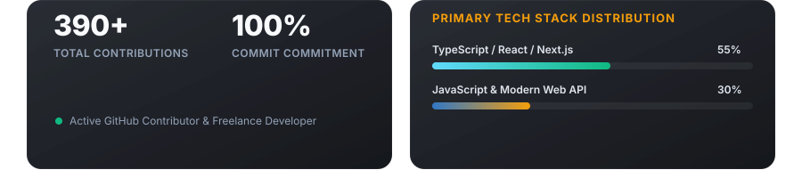

  <!-- ==================== HERO SECTION ==================== -->
  
  <!-- Centered Hero Portrait Artwork (Raw GitHub Photo Frame Embed) -->
  

   

  <!-- Hero Header Typography (Name, Subtitle, Philosophy) -->
  

   

  <!-- Glassmorphic Interactive Navigation Pills (Freelance & Academic Portfolios) -->
  

    
  

    

  <!-- ==================== DIVIDER I ==================== -->
  

    

  <!-- ==================== ABOUT BENTO SECTION ==================== -->
  <!-- Bento Grid Cards: Who I Am, Freelance & Academic Portfolios, Services -->
  

    

  <!-- ==================== DIVIDER II ==================== -->
  

    

  <!-- ==================== SKILLS SHOWCASE ==================== -->
  <!-- Glass Tech Matrix (Languages, Frontend, Backend, Cloud, Tools, AI) -->
  

    

  <!-- ==================== DIVIDER III ==================== -->
  

    

  <!-- ==================== CERTIFICATIONS & EXPERIENCE ==================== -->
  <!-- Glassmorphic Certifications & Education Grid -->
  

    

  <!-- ==================== DIVIDER ==================== -->
  

    

  <!-- ==================== INTEGRATED GITHUB METRICS ==================== -->
  <!-- Custom Section Header for Metrics -->
  

   

  <!-- Native Reliable GitHub Statistics & Tech Stack Card -->
  

    

  <!-- Live Streak Statistics -->
  

    
  

    

  <!-- Native Reliable Glassmorphic GitHub Trophies -->
  

    

  <!-- Live Activity & Contribution Graph -->
  

    
  

    

  <!-- ==================== DIVIDER ==================== -->
  

    

  <!-- ==================== CONNECT & OUTREACH ==================== -->
  <!-- Interactive Glass CTA Card -->
  

    

  <!-- ==================== PROFILE VISITS COUNTER ==================== -->
  

    
  

    

  <!-- ==================== FOOTER & BRAND SIGNATURE ==================== -->
  

